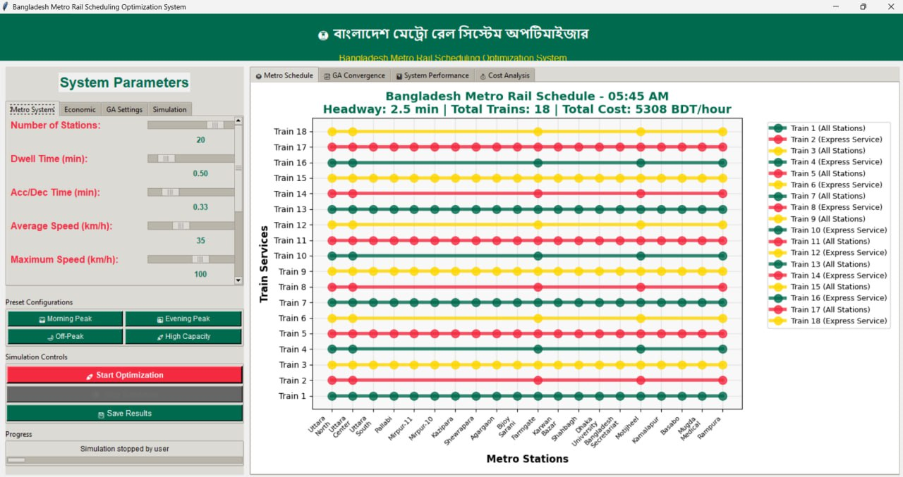
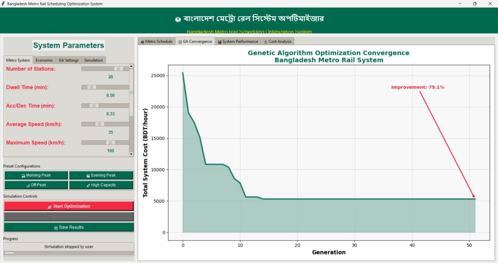
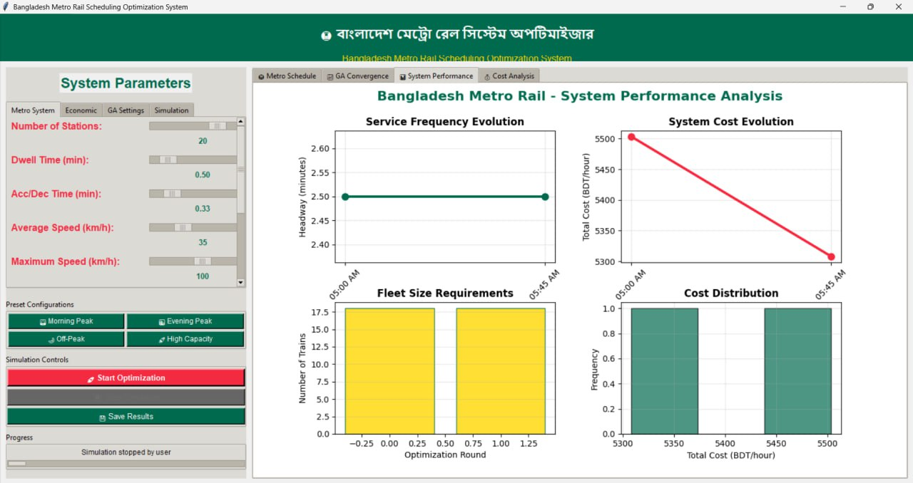
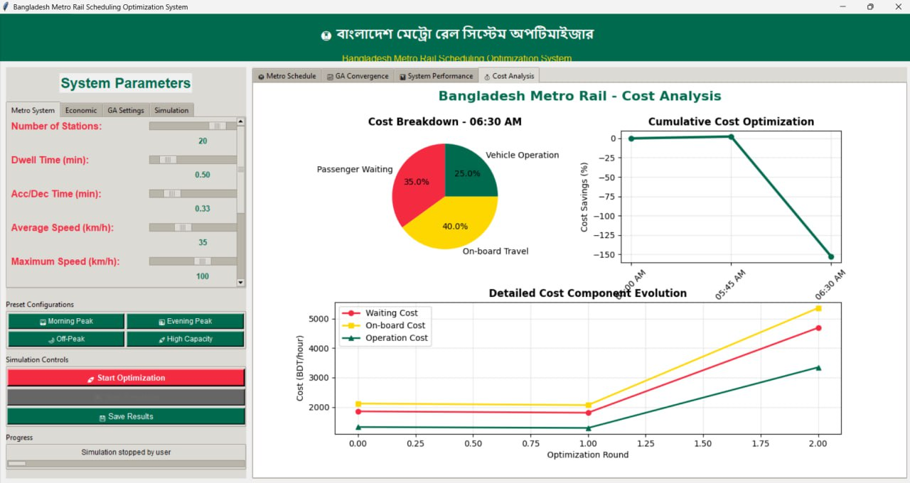
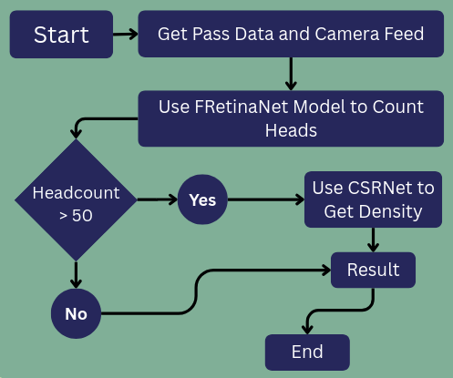
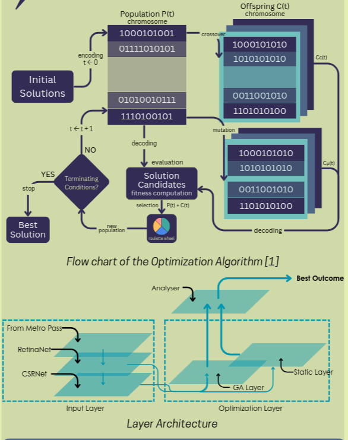
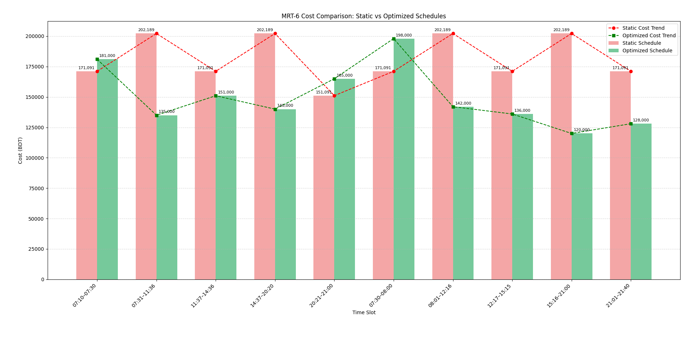

# Evaluating MRT Line-6 Scheduling in Dhaka: A Dynamic, Data-Driven Approach

## Project Overview

This project presents a dynamic, data-driven approach to optimizing the scheduling of Dhaka's MRT Line-6. By leveraging real-time passenger volume estimation through deep learning and genetic algorithms, we aim to improve operational efficiency, reduce costs, and enhance passenger experience compared to the current static schedule.

## Motivation

Dhaka's MRT currently operates on a fixed schedule, which may not adapt to fluctuating passenger demand. This can result in increased operational costs, lower revenue, and longer passenger wait times. Our project investigates whether a dynamic schedule, informed by real-time data, can outperform the existing system.

## Methodology

### 1. Passenger Volume Estimation
- **Data Sources:**
  - Metro card (Rapid Pass) data
  - Surveillance camera feeds from station platforms
- **Techniques:**
  - Deep Learning models (RetinaNet for moderate crowds, CSRNet for high-density crowds)
  - Computer vision headcount estimation

### 2. Optimization
- **Genetic Algorithm:**
  - Used to optimize train headways dynamically based on estimated passenger volumes
- **Cost Calculations:**
  - **Value of Time (VoT):**
    - Formula: `VoT = (Monthly Income / Number of Weeks) / (Working Hours × 60) × 1.5`
    - Result: **3.5 tk/min**
  - **Operational Cost:**
    - Formula: `Operational Cost = Total Cost Per Day / (Active Hours × Number of Trips × 60)`
    - Result: **146 tk/min**

### 3. Simulation & Evaluation
- Simulated both the current static schedule and the proposed dynamic schedule
- Compared passenger waiting costs and operational costs

## Dataset

The dataset includes estimated passenger flows for each station, time interval, and direction, with business weights assigned to stations based on their activity levels.

**Sample (first few rows):**

```
Direction,Start Time,End Time,Station,Weight,Estimated Passengers,Passengers per Minute,Headway
0,7:10,7:30,Motijheel,2,433,21.65,10
0,7:10,7:30,Bangladesh Secretariat,1,216,10.82,10
0,7:10,7:30,Dhaka University,1.5,325,16.24,10
... (see full CSV in Images/Evaluating_MRT_Line6_Dhaka/)
```

- **Files:**
  - `metro_weighted_station_passengers 23a499b277fa814d9c56fe44b636d9c8.csv`
  - `metro_weighted_station_passengers 23a499b277fa814d9c56fe44b636d9c8_all.csv`

## Project Outputs

### Visualizations & Results

- 
- 
- 
- 
- 
- 
- 

### Key Findings
- Reduced total cost by **17.6%**
- Significantly reduced wasted working hours and environmental impact

## References

- Shaik, S. (2025, April 2). What Is The Average Salary In Bangladesh: Overview & Insights. *Time Champ - Time and Productivity Tracker*. https://www.timechamp.io/blogs/average-salary-in-bangladesh/
- Talukder, M. S. H., & Tuz Zahra, F. (2023, June 21). *What work‑life balance? Giving employees more control over their work schedules and environments helps reduce the negative effects of long hours and difficult workloads.* Dhaka Tribune. [https://www.dhakatribune.com/opinion/op-ed/313958/what-work-life-balance](https://www.dhakatribune.com/opinion/op-ed/313958/what-work-life-balance)
- Observer Online Desk. (2024, March 27). *Dhaka Metro Rail operations to continue past 9 pm from Wednesday*. The Daily Observer. [https://www.observerbd.com/news/466118](https://www.observerbd.com/news/466118)
- Scheduling Combination and Headway Optimization of Bus Rapid Transit. (2008). In *JOURNAL OF TRANSPORTATION SYSTEMS ENGINEERING AND INFORMATION TECHNOLOGY* (Vol. 8, Issue 5) [Research paper]. https://doi.org/10.1016/S1570-6672(08)60039-2
- Railway Supply. (2025, February 16). *Dhaka Metro breaks record, transporting 403,164 passengers in a single day.* [https://www.railway.supply/en/dhaka-metro-breaks-record-transporting-403164-passengers-in-a-single-day/](https://www.railway.supply/en/dhaka-metro-breaks-record-transporting-403164-passengers-in-a-single-day/)
- *ঢাকা ম্যাস ট্রানজিট কোম্পানি লিমিটেড (ডিএমটিসিএল)*. (n.d.). https://dmtcl.gov.bd/site/page/d95a6907-4278-4a36-8a90-ee38c2dd43e8/%E0%A6%B8%E0%A6%AE%E0%A7%9F%E0%A6%B8%E0%A7%82%E0%A6%9A%E0%A6%BF
- Hossain, A. (2025, July 9). *The busiest and least used metro stations*. Prothom Alo English. [https://en.prothomalo.com/bangladesh/city/c4664wsnb6](https://en.prothomalo.com/bangladesh/city/c4664wsnb6)

---

For more details, see the full project documentation in `Images/Evaluating_MRT_Line6_Dhaka.md` and the [project repository](https://github.com/ahmfuad/metro-scheduler/). 